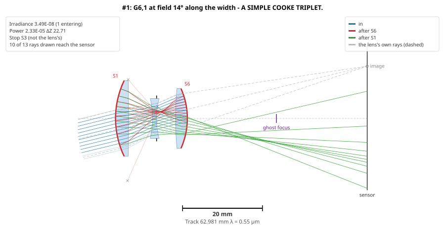

# GhostAnalysis

Ghost image analysis of a lens. Open a lens in any format
[AberrationCalculator](https://github.com/jaruiz6363/AberrationCalculator) reads - ZEMAX, CODE V,
OSLO, OpTaliX, Optiland, LensHH-LT - and GhostAnalysis finds every ghost it forms by an even number
of reflections, the sensor's included, and tells you which are bright, where they land, why, and
what they look like.

## Built on Abd El-Maksoud and Sasian

GhostAnalysis starts from two papers, and uses much of their mathematics:

1. R. H. Abd El-Maksoud and J. M. Sasian, "Paraxial ghost image analysis," *Proc. SPIE* **7428**,
   742807 (2009). doi:10.1117/12.828564
2. R. H. Abd El-Maksoud and J. M. Sasian, "Modeling and analyzing ghost images for incoherent
   optical systems," *Appl. Opt.* **50**, 2305-2315 (2011).

From them it takes the core of the method: every reflection path unfolded into a ghost lens of its
own and traced paraxially; the ghost's stop found by the fill-ratio rule; its focal length, back
focus, pupils, defocus and size at the sensor; its paraxial irradiance; its third-order image
surfaces; and the ghosts that come into focus on the sensor off axis, where those surfaces cross it.
The 2009 paper's worked example is reproduced to every printed digit, and is the first check of the
code ([verification](docs/verification.md)).

What GhostAnalysis adds:

- **The sensor reflects.** The papers' ghosts reflect only from lens surfaces; here the sensor is a
  reflector too, often the source of the brightest ghosts, and optionally a diffraction grating that
  splits each of its reflections into orders.
- **Real rays**, aimed at each ghost's real stop, through every ghost at every field: its real spot,
  centroid and focus, where the paraxial analysis has only discs.
- **Real apertures and a real sensor.** Rays are stopped at the edges of the glass and the sensor,
  sized to the lens's own beam where the file does not say.
- **The worst field.** Each ghost is followed across the field, past the lens's own edge, and ranked
  by where it is brightest; the focus crossings are found by real rays as well as predicted.
- **Colour, drawings, and checking.** Several wavelengths, each ghost drawn in the lens, and each
  ghost exportable as a lens file, so another program can analyse it independently.

The [method](docs/method.md) gives the equations, and where they come from in the papers.



## What it does

- **Every ghost, unfolded into a lens of its own.** Each reflection path becomes a folded
  sequential lens, analysed by the same code as the lens itself: its focus, pupils, stop, size at
  the sensor and brightness - Abd El-Maksoud and Sasian's paraxial ghost analysis, reproduced to
  every printed digit of their worked example.
- **The sensor reflects**, as real sensors do - often the brightest ghosts there are.
- **Real rays, across the field.** Each ghost's real spot at every field, its rays aimed at its
  real stop, stopped at the glass's edges and the sensor's, ranked by its worst field - a bright
  source just outside the picture included.
- **Checked ghost by ghost.** Each ghost can be written out as a lens file and analysed in another
  program; against LensHH-LT, first order and real rays agree exactly
  ([verification](docs/verification.md)).
- **Ghosts that focus off axis.** Where a ghost's image surfaces cross the sensor, predicted from
  its Seidel sums and found by real rays, and where it is brightest, found by a fine scan.
- **The sensor as a grating.** Given its pixel period, each sensor reflection diffracts into
  orders: the dot grids of red-dot flare.
- **Colour.** Each wavelength analysed, each ghost's light added up over the spectrum, with its
  colour.
- **Drawings.** The brightest ghosts drawn in the lens, their real rays leg by leg.

## Quick start

```bash
git clone --recursive https://github.com/jaruiz6363/GhostAnalysis.git
cd GhostAnalysis
dotnet build
dotnet run --project src/GhostAnalysis.Cli -- -i examples/Cooke_40deg_FC.zmx --coated 0.005 --layouts
```

That analyses a Cooke triplet's ghosts at its three wavelengths, prints the report, and writes the
five brightest as drawings with an HTML page to open. The picture above is this lens's ghost G6,1
at 14°: light reflected by the last surface and then the first crosses the lens twice and lands
on the opposite side of the sensor from the image
([example 3](docs/examples.md#3-a-cooke-triplet-across-a-36--24-sensor)).

A camera lens, coated, with a real sensor that diffracts:

```bash
ghost -i mylens.zmx --coated 0.005 --sensor-reflectance 0.2 --sensor 36x24 --sensor-period 6 -o ghosts.txt --layouts
```

## Documentation

- **[User guide](docs/user-guide.md)** - building, running, every option, reading the report and
  the drawings, typical runs.
- **[How it works](docs/method.md)** - the method, step by step, with its equations and its
  validation.
- **[Examples](docs/examples.md)** - the papers' lens; a ghost that focuses off axis; a Cooke
  triplet; and six vehicle-camera lenses from US 8,264,785, with a diffracting sensor, an IR filter
  and cover glass, and stopped down.
- **[Verification](docs/verification.md)** - how the numbers are checked: against the papers, by
  independent derivation, and ghost by ghost against LensHH-LT.
- **[References](docs/references.md)** - the papers and patents it rests on.
- **[Building](BUILDING.md)** - installing .NET and building from source.

## Authors

Javier Ruiz and Claude Code.

## License

MIT - see [LICENSE](LICENSE).
