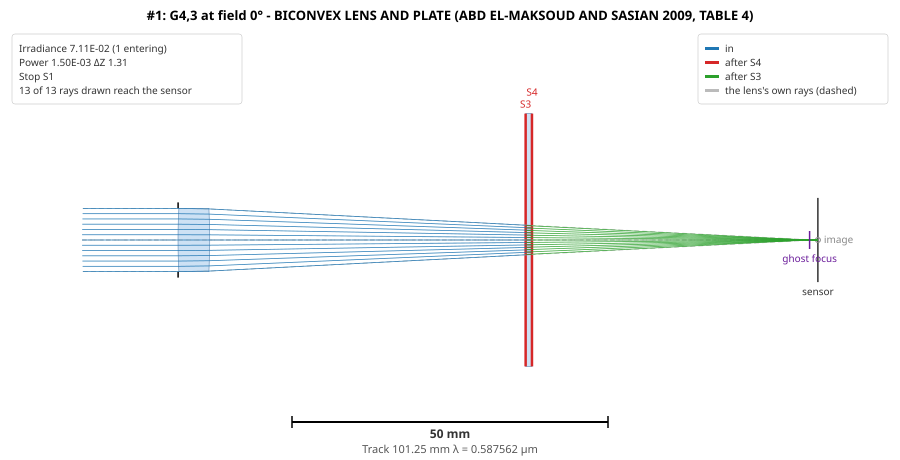
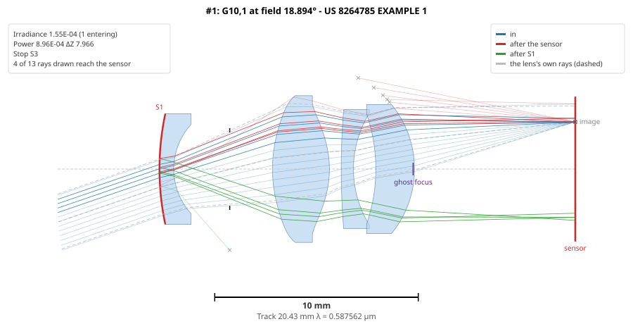
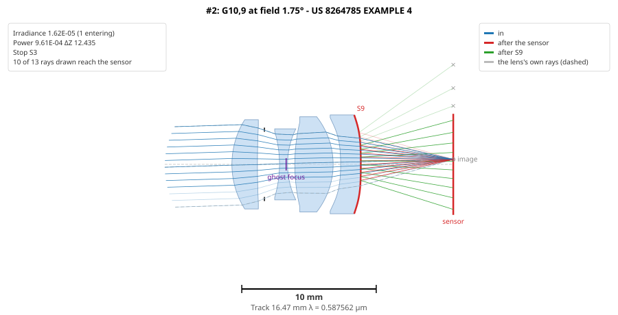
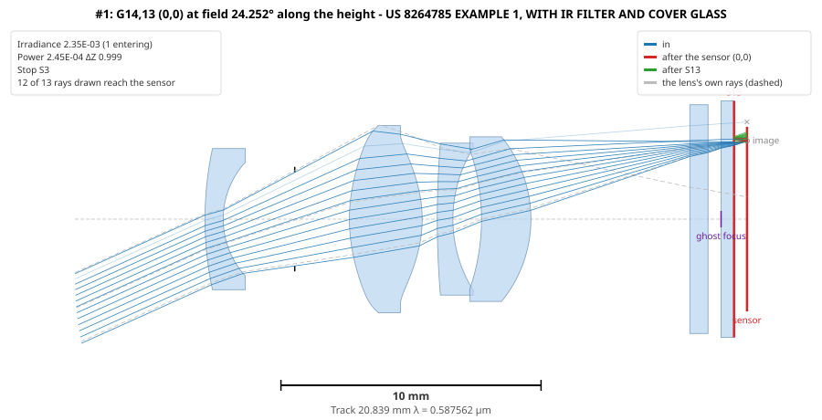
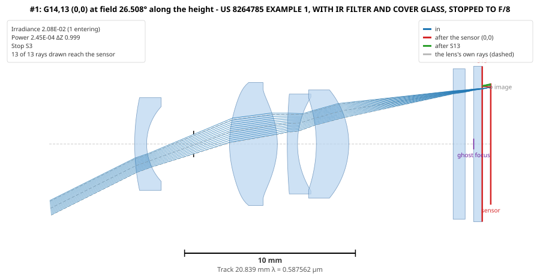

# Examples

Worked examples, each with the command that produces it and what it shows. The lens files are in
[`examples/`](../examples); run the commands from the repository's root (`ghost` is the program -
see the [user guide](user-guide.md#running-it)). Numbers are per unit power entering the lens's
pupil.

1. [The papers' example: validation](#1-the-papers-example-validation)
2. [A ghost that focuses off axis](#2-a-ghost-that-focuses-off-axis)
3. [A Cooke triplet across a 36 × 24 sensor](#3-a-cooke-triplet-across-a-36--24-sensor)
4. [US 8,264,785: a vehicle camera lens and its sensor ghosts](#4-us-8264785-a-vehicle-camera-lens-and-its-sensor-ghosts)

---

## 1. The papers' example: validation

`examples/Maksoud_BiconvexPlate.zmx` is Abd El-Maksoud and Sasian's worked example [1, 2]: a
biconvex BK7 lens, R 100/−100 and 5 thick, its stop at its front, and a 1 mm BK7 plate 50 behind
it, the object at infinity, EPD 10.

```bash
ghost -i examples/Maksoud_BiconvexPlate.zmx --no-sensor --layouts 1
```

`--no-sensor` gives the papers' six ghosts. Their first order, against the 2009 paper's Tables 5
and 6:

| Ghost | f_E | BFD | d′ | y′ | L′_g | ΔZ | D_xp | f/# |
|---|---|---|---|---|---|---|---|---|
| G2,1 | 15.4447 | −40.3803 | −55.8250 | −27.7216 | 23.2064 | 85.6303 | 15.0255 | 1.5445 |
| G3,1 | 138.1157 | −64.5371 | −202.6527 | −3.9745 | −43.7472 | 109.7871 | 3.1674 | 13.8116 |
| G3,2 | 90.2153 | −54.4332 | −144.6484 | −5.5247 | 29.9239 | 99.6832 | 3.3169 | 9.0215 |
| G4,1 | 149.0991 | −67.3887 | −216.4878 | −3.7773 | −46.4731 | 112.6387 | 3.1169 | 14.9099 |
| G4,2 | 88.0681 | −55.5334 | −143.6015 | −5.7219 | 28.9627 | 100.7834 | 3.2887 | 8.8068 |
| G4,3 | 97.5804 | 43.9402 | −53.6402 | −0.0671 | 99.2716 | 1.3098 | 10.1733 | 9.7580 |

Every value matches the paper's to its printed digits, except six misprints that the paper's own
other columns correct (see [the method](method.md#validation)). The plate's ghost G4,3 focuses
1.31 short of the sensor and is by far the brightest: paraxially 0.106 W/mm² for 1 W entering, as
the 2011 paper's Fig. 8 shows, and 0.071 by real rays, the lens's spherical aberration spreading
it wider than its paraxial disc:



## 2. A ghost that focuses off axis

`examples/Maksoud_ShortSensor.zmx` is the same lens with its sensor at 43.0 behind the plate, not
45.25: just short of where the plate's ghost G4,3 focuses. On axis the ghost is 0.94 out of focus;
off axis its curved image surfaces bring it onto the sensor [2, section 12].

```bash
ghost -i examples/Maksoud_ShortSensor.zmx --no-sensor --fields 0,0.5,1,1.5,2,2.5,3,3.5,4,4.5,5,5.5,6,6.5,7,7.5,8,8.5,9,9.5,10 --layouts 1
```

|   | Tangential | Sagittal |
|---|---|---|
| Third-order prediction | 4.33° | 6.33° |
| Real crossing | 4.34° | 6.37° |

The ghost is brightest between the axis and the tangential crossing - at 3.75°, found by the fine
scan between the sweep's half-degree steps (`P` in the report) - at 1.45, 3.7 times its 0.39 on
axis, its RMS spot 12.6 µm there against 24.6 µm on axis:


**In colour.** The same lens at F, d and C:

```bash
ghost -i examples/Maksoud_ShortSensor.zmx --no-sensor --fields 0,0.5,1,1.5,2,2.5,3,3.5,4,4.5,5,5.5,6,6.5,7,7.5,8,8.5,9,9.5,10 --wavelengths 0.4861327,0.5875618,0.6562725
```

At 3.75° the ghost is 71 % green: the lens's own colour moves its focus, ΔZ = +0.08 in the blue,
−0.94 at d and −1.40 in the red, so only the green is sharp on the sensor (RMS 13 µm, against 34 in
the blue and 25 in the red).

| λ (µm) | ΔZ | Irradiance at 3.75° | RMS (µm) | Share |
|---|---|---|---|---|
| 0.4861 | +0.082 | 0.21 | 34.0 | 10 % |
| 0.5876 | −0.940 | 1.45 | 12.6 | 71 % |
| 0.6563 | −1.402 | 0.38 | 24.5 | 19 % |

## 3. A Cooke triplet across a 36 × 24 sensor

`examples/Cooke_40deg_FC.zmx`, f = 50, F/5, 20° half-field, coated at 0.5 %, with a 36 × 24
sensor and the fields across its width:

```bash
ghost -i examples/Cooke_40deg_FC.zmx --coated 0.005 --sensor 36x24 --field-direction width --layouts 2 --layout-field 14
```

At 14° the brightest ghost is G6,1 - off the last surface, back to the first - landing on the
**opposite** side of the sensor from the image (magnification −0.8), some of its rays stopped by the
front lens's edge on the way back:


Across the width, 14° images at 13.1, inside the sensor's 18; across its height (the default
direction) the edge is at 12, and the drawing would say the image is off the sensor.

## 4. US 8,264,785: a vehicle camera lens and its sensor ghosts

US 8,264,785 [11] is a Tamron vehicle-camera lens written against ghosts from light the sensor
reflects. Its criterion is θ ≥ 30°, θ being the angle between the on-axis marginal ray leaving the
last lens surface and that surface's normal: meeting it sends light reflected by the sensor and
then by the last surface away from the axis. Its six examples come in two families: Examples 1-3
(f ≈ 6.9, F/2-2.5, 28° half-field) meet θ ≥ 30°; Examples 4-6 (f ≈ 12, F/2, 17.5°) meet a looser
criterion, BF/L ≥ 0.3 with θ ≥ 15°, at θ ≈ 20°.

### 4.1 The lenses, from the patent's tables

`examples/US8264785/Ex1.zmx` to `Ex6.zmx`, nd/νd model glasses, the object at the patent's 60 m
(Examples 1-3) or 11.26 m (4-6). Built from the patent's tables and checked against its own
figures:

| Ex | f (patent) | θ (patent) | Image at | Checked against |
|---|---|---|---|---|
| 1 | 6.890 (6.9) | 31.3° (31.2°) | 7.9 | Fig. 3: image heights 0.88-3.55, distortion −4 %, spherical aberration's shape |
| 2 | 6.881 (6.9) | 31.9° (31.8°) | 7.9 | |
| 3 | 6.771 (6.8) | 36.4° (36.5°) | 7.1 | |
| 4 | 12.039 (12.0) | 19.6° (19.7°) | 6.88 | Fig. 10: spherical aberration, inner zones |
| 5 | 12.147 (12.13) | 21.9° (21.5°) | 6.87 | see below |
| 6 | 12.035 (12.0) | 20.5° (20.6°) | 6.89 | Fig. 14: spherical aberration, inner zones |

Things the tables do not say, settled against the lens itself:

- **The aspheric conic.** The patent writes its asphere with a constant ε, X = (H²/R)/(1 + √(1 − εH²/R²)) + BH⁴ + ...
  For **Examples 1-3, ε is the conic k itself**: read as 1 + k the lenses fall apart (384-733 µm
  on axis against 2-7 µm). For **Examples 4-6, ε is 1 + k**, as the formula says - Example 6's
  ε = 1.0000 on both aspheres is then a sphere, and Example 4 is sharper so (0.5 against 5.2 µm).
  The two families evidently came from different programs.
- **Example 2** prints its fifth surface's E coefficient as −4.91814 × 10⁷; it is read as 10⁻⁷.
- **Example 5**'s spherical aberration does not match its Fig. 12 - strongly negative at the rim
  where the figure is positive - under either reading of ε. A coefficient is wrong, in the patent or
  in reading its scan. Its focal length, back focus and θ are right, and its file says so.
- **No semi-diameters** are given; each surface is sized to pass the lens's full field (method,
  section 9).

### 4.2 The six designs

```bash
ghost -i examples/US8264785/Ex4.zmx --coated 0.005 --sensor-reflectance 0.2 --wavelengths primary --layouts 3
```

(and so for each), coated at 0.5 %, the sensor reflecting 20 % - the patent's "several tens of
percent" - over its image circle:

| Ex | θ | Last-surface sensor ghost (the one θ is about) | Its rank | Brightest ghost |
|---|---|---|---|---|
| 1 | 31.3° | 4.6 × 10⁻⁶ | 8th of 36 | G10,1, sensor → front surface, 1.5 × 10⁻⁴ |
| 2 | 31.9° | 4.1 × 10⁻⁶ | 9th | G10,1, 1.2 × 10⁻⁴ |
| 3 | 36.4° | 4.1 × 10⁻⁶ | 10th | G10,1, 1.3 × 10⁻⁴ |
| 4 | 19.6° | 1.6 × 10⁻⁵ | 3rd | G8,7, in the air gap before the last element, 1.8 × 10⁻⁵ |
| 5 | 21.9° | 1.5 × 10⁻⁵ | 3rd | G9,8, inside the last element, 4.4 × 10⁻⁵ |
| 6 | 20.5° | 1.4 × 10⁻⁵ | 4th of 55 | G11,4, 4.6 × 10⁻⁵ |

With θ ≥ 30° the last-surface ghost is weak and far down the list; at θ ≈ 20° it is about three
times brighter and near the top. In the first family the worst sensor ghost is instead the one off
the front surface, which is what the patent's second criterion, f/R₁ ≥ 0.3, addresses.





### 4.3 A diffracting sensor

The sensor is also a grating. With a 6 µm period (a 3 µm Bayer pixel):

```bash
ghost -i examples/US8264785/Ex4.zmx --coated 0.005 --sensor-reflectance 0.2 --wavelengths primary --sensor-period 6
```

Each sensor ghost splits into orders - with the default fill factor the zeroth keeps 26 % of the
reflected light, each first order about 10 % - turned by λ/Λ ≈ 0.1. But every order of these ghosts
is a disc wider than the spacing between orders: the last-surface ghost's are 3.0-3.5 in radius,
their centres about 0.45-0.6 apart. At F/2-2.5 the grid smears into a veil; no dots.

### 4.4 With an IR filter and a cover glass

A real vehicle camera has plates in front of the sensor, which the patent's prescriptions do not:
here an IR-cut filter 0.7 thick and a cover glass 0.5 thick, both n = 1.5168, the cover 0.5 from
the sensor and the filter 0.5 before it, coated like the lens, the image moved back by the
0.409 the plates shift the focus. `examples/US8264785/Ex*_plates.zmx`:

```bash
ghost -i examples/US8264785/Ex1_plates.zmx --coated 0.005 --sensor-reflectance 0.2 --wavelengths primary --sensor-period 6 --layouts 1
```

**The cover glass's rear face becomes the brightest ghost of every design**, 1.0-2.3 × 10⁻³ -
25 to 110 times the brightest lens ghost - a flat face half a millimetre from the sensor sending the
light straight back in a tight disc. θ cannot touch it: the plates have no curvature.



Its diffraction orders are spaced by the plate face's distance from the sensor, 2Lλ/Λ with L its
reduced distance (glass counted as thickness / n), in all six (on axis, full aperture and F/8):

| Face | Distance from sensor | Order spacing | 2Lλ/Λ |
|---|---|---|---|
| cover glass, rear | 0.5 air | 0.099-0.102 | 0.098 |
| cover glass, front | + 0.5 glass | 0.163-0.168 | 0.163 |
| IR filter, rear | + 0.5 air | 0.262-0.269 | 0.261 |
| IR filter, front | + 0.7 glass | 0.353-0.361 | 0.351 |

### 4.5 Stopped down to F/8

`examples/US8264785/Ex*_plates_F8.zmx`: the same lenses with only the stop closed, to F/8 - the
elements keep the apertures their full-aperture design needs, written into the files:

```bash
ghost -i examples/US8264785/Ex1_plates_F8.zmx --coated 0.005 --sensor-reflectance 0.2 --wavelengths primary --sensor-period 6 --layouts 1
```

The orders' spacing stays; their discs shrink three to four times (on axis):

| Face | spacing ÷ disc diameter at F/2-2.5 | at F/8 |
|---|---|---|
| cover glass, rear | 0.19-0.25 | 0.74-0.79 |
| cover glass, front | 0.19-0.25 | 0.75-0.79 |
| IR filter, rear | 0.19-0.25 | 0.76-0.79 |
| IR filter, front | 0.19-0.25 | 0.77-0.79 |

The ratio is the same for every face of every lens: both the spacing and the disc grow with the
face's distance, which cancels, leaving **spacing ÷ diameter ≈ N λ / Λ** - 0.78 at F/8, 0.24-0.25
at F/2.5 (Examples 1 and 2), 0.19-0.21 at F/2. At F/8 the dots are distinct, neighbours still overlapping by a fifth of their
width; they separate entirely beyond N = Λ/λ, which for a 6 µm period is F/10.2 at 0.588 µm,
F/9.1 at 0.656 µm - and **F/6.4 at 940 nm**, where out-of-band coatings on the cover glass can make
these ghosts very strong indeed.



---

References in brackets are to the [references](references.md).
