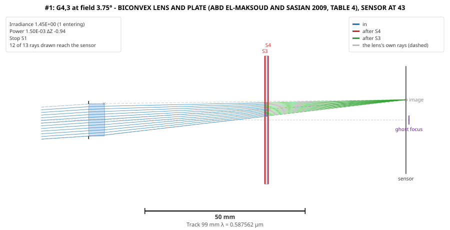

# GhostAnalysis user guide

GhostAnalysis finds every ghost a lens forms by an even number of reflections, analyses each one,
and ranks them by how bright they are on the sensor. This guide covers building it, running it,
every option, and how to read what it produces. The [method](method.md) explains how each number
is computed; the [examples](examples.md) walk through real lenses.

## 1. Building

You need the **.NET 8 SDK** or later ([BUILDING.md](../BUILDING.md) has installers for Windows,
macOS and Linux).

GhostAnalysis builds on AberrationCalculator, whose source the repository carries, so a plain clone
builds:

```bash
git clone https://github.com/jaruiz6363/GhostAnalysis.git
cd GhostAnalysis
dotnet build
dotnet test
```

On Windows, clone to a short path (such as `C:\GIT\GhostAnalysis`): AberrationCalculator's build
paths are deep, and a long starting path can exceed Windows' 260-character limit.

### Running it

From the repository, during development:

```bash
dotnet run --project src/GhostAnalysis.Cli -- -i examples/Maksoud_BiconvexPlate.zmx
```

(`--` separates `dotnet`'s arguments from the program's.) Or publish a standalone executable,
`ghost`, which needs no .NET installed:

```bash
dotnet publish src/GhostAnalysis.Cli -c Release -r win-x64 --self-contained -o publish/win-x64
publish/win-x64/ghost -i mylens.zmx
```

(`-r osx-arm64`, `osx-x64` or `linux-x64` for the other platforms.) This guide writes the command
as `ghost`.

## 2. The lens

`-i` names the lens file, in any format AberrationCalculator reads, told apart by its extension:

| Extension | Format |
|---|---|
| `.zmx` | ZEMAX |
| `.seq` | CODE V |
| `.len` | OSLO |
| `.otx` | OpTaliX |
| `.json` | Optiland |
| `.lhlt` | LensHH-LT |

What GhostAnalysis takes from the file: the surfaces, glasses, stop, aperture, fields, wavelengths
and their weights, and the surfaces' semi-diameters.

- **Fields.** The analysis sweeps from the axis to 1.2 times the file's largest field. A file whose
  only field is on axis (some exports say `ANG 0`) is analysed on axis only unless `--fields` is
  given.
- **Semi-diameters.** Where the file gives them, they are the edges of the glass. Where it gives
  none, each surface gets the aperture needed to pass the lens's full beam, its rays aimed at its
  stop, at every field up to its largest (method, section 9), and the report says which surfaces
  were sized so.

## 3. Options

Every option, grouped. Reflectances and efficiencies are **fractions** - 0.1 is 10 % - and a
reflectance above 1 is refused.

### What counts as a ghost, and how bright

| Option | Default | |
|---|---|---|
| `-i`, `--input <file>` | | the lens (required) |
| `-o`, `--output <file>` | | also write the report to this file |
| `-n`, `--reflections <n>` | 2 | reflections per ghost: 2, 4, ... Each pair more is weaker by about R². |
| `--coated <R>` | uncoated | every glass-air surface reflects R; otherwise Fresnel's normal-incidence value |
| `--cemented-fresnel` | | cemented surfaces - a doublet's inner surface - reflect Fresnel's value between the two glasses. By default they do not reflect, and no ghost uses them. |
| `--sensor-reflectance <R>` | 0.05 | the sensor's reflectance. No lens file gives it; measure or look it up. |
| `--no-sensor` | | the sensor does not reflect, as in the papers |
| `--power <P>` | 1 | power entering the lens's pupil; irradiances are per unit of it |

### Where to look

| Option | Default | |
|---|---|---|
| `--fields <f1,f2,...>` | the sweep | the fields to analyse, in the lens's field units (degrees, or object height) |
| `--field-extent <x>` | 1.2 | sweep to x times the lens's largest field |
| `--field-steps <n>` | 12 | steps in the sweep |
| `--wavelengths <list>` | the lens's | wavelengths in µm, each with an optional weight: `0.486,0.588,0.656` or `0.486:1,0.588:2,0.656:1`; `primary` for the lens's primary alone |
| `--pupil <n>` | 21 | real rays across each ghost's pupil. A strongly aberrated spot, its rays crowded to the rim, wants more: 41 brings its RMS within a few tenths of a per cent ([verification](verification.md#33-aspheres-a-finite-object-and-wide-fields-us-8264785)) |
| `--no-ray-aiming` | aimed | launch the real rays across the paraxial entrance pupil instead of aiming each at the stop - about three times faster, and on a fast or wide-angle lens a few per cent to tens of per cent wrong |
| `--paraxial` | | no real rays: the papers' paraxial analysis only, much faster |

### The sensor

| Option | Default | |
|---|---|---|
| `--sensor <W>x<H>` | the image circle | the sensor's size, in lens units, width by height. Light off it is not seen, and a sensor ghost reflects only where it is. Without it, the sensor is the lens's image circle. |
| `--field-direction <d>` | `height` | which way the fields run on the sensor: `height`, `width`, `diagonal`, or an angle in degrees from the height |
| `--sensor-period <P>[x<Q>]` | none | the pixel grating's period in µm: the pixel pitch, or twice it for a Bayer colour sensor. The sensor then diffracts. |
| `--fill <f>` | 0.5 | each pixel's reflecting aperture as a fraction of the period, for the order efficiencies sinc²(mf)·sinc²(nf). A placeholder; f = 1 is a mirror. |
| `--order-table <file>` | | measured order efficiencies instead: lines of `m, n, efficiency`; `#` starts a comment |
| `--orders <n>` | 2 | the largest \|m\| and \|n\| analysed |
| `--min-efficiency <e>` | 0.001 | leave out orders, and combinations of them, carrying less than e of the reflected light |

### Output

| Option | Default | |
|---|---|---|
| `--detail <n>` | 5 | how many of the brightest ghosts the report shows field by field |
| `--layouts [n]` | 5 | draw the n brightest ghosts in the lens: an SVG each, and one HTML page with them all |
| `--layout-dir <dir>` | beside `-o`, or here | where to write the drawings |
| `--layout-field <f>` | each at its brightest | draw at this field the ghosts brightest there |
| `--export-layouts <dir>` | | write each ghost's unfolded lens there (`<lens>_G4-3.lhlt`, ...), and every ghost's results, a row per ghost, field and wavelength, as `<lens>_ghosts.csv` - to check a ghost in another lens program ([verification](verification.md)) |
| `--export-format <ext>` | `lhlt` | the unfolded lenses' format: `lhlt`, `zmx`, `seq`, `len`, `otx` or `json`. `lhlt`, `zmx` and `otx` are checked exact; `seq` and `len` have caveats and `json` is not usable yet ([verification](verification.md#35-the-other-formats-and-optalix-and-oslo-themselves)) |
| `-h`, `--help` | | the option list |

## 4. Reading the report

The report is plain text: written to the console, and to `-o` if given. Its sections, in order:

**The header** says what was assumed: the wavelengths, focal length and entrance pupil, reflections
per ghost, the coating, the sensor's reflectance and size (the image circle, if none was given),
**which surfaces' apertures were sized** because the file gave none, the field direction and grating
if any, and the fields analysed. Read it first: an assumption you did not intend shows here.

**Surface reflectances** - each surface's, and the sensor's. With several wavelengths, a column
per wavelength.

**With several wavelengths, the spectral ranking**: every ghost's irradiance added up over the
spectrum, at its brightest field, and each wavelength's share of it - the ghost's colour. Then,
for the brightest, each wavelength's ΔZ, irradiance, landing point and RMS spot at that field:
where the colour fringe comes from. The rest of the report is at the primary wavelength.

**The ranking** - every ghost, brightest at its worst field first:

| Column | Meaning |
|---|---|
| Ghost | the surfaces it reflects from, in order (G4,3: off 4, then off 3); the last surface number is the sensor. A diffracted order follows, (m,n). |
| Peak irrad. | its irradiance at its brightest field, per unit power entering |
| at field | that field |
| x, y on sensor | where it lands there |
| Radius | the radius its power is taken to spread over there |
| Axis irrad. | its paraxial irradiance on axis |
| ΔZ | how far short of the sensor it focuses on axis |
| Mag | where it lands as a multiple of the image height: −1 is mirrored through the centre |
| Stop | the lens surface that stops it; `*` if not the lens's own stop |

**Ghosts that focus on the sensor off axis** - for each, the fields where its real tangential (T)
and sagittal (S) foci reach the sensor, and where its third-order image surfaces predict they do.
`(vignetted)` marks a crossing none of its light reaches.

**The brightest ghosts field by field** - for each: its field stop and unvignetted field, then per
field the lens's image height, the ghost's paraxial centre, its real centroid, RMS and largest
radius, the share of the light entering its paraxial pupil that arrives (Passed: the rays not
vignetted, times the area of the real pupil its stop lets in, so a fast lens's unvignetted ghost
shows a little under 1), its irradiance, and its real tangential and
sagittal foci. A field marked `T` or `S` is a focus crossing; one marked `P` is where a fine scan
found it brightest, between the sweep's fields.

**First order of each ghost** - the papers' quantities (method, section 4): f_E, BFD, d′, y′,
D_ep, L′_g, L′_g,n, D_xp, f/#. An order shares its ghost's first order and is listed once.

## 5. Reading the drawings

`--layouts` writes `<lens>_ghost<k>_<name>.svg` for each of the brightest ghosts, and
`<lens>_ghosts.html` showing them all; open the page in a browser.



- **The lens** in section, each glass drawn out to the apertures the analysis used - the file's, or
  the sized ones - and the stop's bars.
- **The ghost's rays**: a fan in the plane of the field, folded back into the lens, one colour per
  leg - blue in, red after the first reflection, green after the second. The legend names each leg
  and, at a diffracting sensor, its order.
- **The reflecting surfaces** in red and labelled; the sensor turns red when it reflects.
- **A ray drawn faintly, ending in a small cross**, was stopped there - by a surface's edge or the
  sensor's.
- **Ghost focus**: the ghost's paraxial focus, when it is near.
- **The lens's own rays**, dashed grey, and **image**: where they form the image at this field.
- **The panel** gives the ghost's irradiance, power, ΔZ, stop and how many of the drawn rays reach
  the sensor - and says when the lens's own image falls off the sensor.

Drawings show the plane of the field only: a diffracted order turned across it (m ≠ 0 along the
height) is drawn where its zeroth order would be; the panel names the order.

## 6. Typical runs

**A first look** at a lens, uncoated, the sensor at 5 %:

```bash
ghost -i mylens.zmx -o ghosts.txt --layouts
```

**A coated camera lens** with a real sensor, fields across its width:

```bash
ghost -i mylens.zmx --coated 0.005 --sensor-reflectance 0.2 --sensor 36x24 --field-direction width -o ghosts.txt
```

**Ghosts that focus off axis**: sweep finely, and draw the brightest at their worst fields:

```bash
ghost -i mylens.zmx --field-steps 48 --layouts 5
```

The *Ghosts that focus on the sensor off axis* section lists the crossings; `P` in the field tables
marks the brightest field found between the sweep's steps.

**The sensor's diffraction**: a 3 µm Bayer sensor (6 µm colour period):

```bash
ghost -i mylens.zmx --coated 0.005 --sensor-reflectance 0.2 --sensor-period 6 --wavelengths primary
```

Each sensor ghost becomes one ghost per order. Whether the orders show as separate dots is decided
by the F-number: spacing ÷ dot diameter ≈ N·λ/Λ (method, section 10).

**Colour**: the lens's own wavelengths are the default; to name them:

```bash
ghost -i mylens.zmx --wavelengths 0.4861327,0.5875618,0.6562725
```

**Comparing designs**: run each with the same options and compare the ranking and the header;
the [US 8,264,785 examples](examples.md#4-us-8264785-a-vehicle-camera-lens-and-its-sensor-ghosts)
do this for six designs.

**The papers' method, exactly**:

```bash
ghost -i mylens.zmx --no-sensor --paraxial
```

## 7. Speed

A two-reflection run on a lens of ten surfaces takes a few seconds to a quarter of a minute. What
makes it slower:

- **Wavelengths**: each is a full analysis. `--wavelengths primary` for one.
- **Diffraction**: each sensor ghost becomes up to 25 ghosts at `--orders 2`. `--orders 1` gives 9.
- **Four reflections**: the count grows as about M⁴.
- **The pupil grid**: `--pupil 11` for a quick look; the default 21 for the report.
- **Ray aiming**: each real ray is searched for, a few traces as far as the stop, and costs about
  three times an unaimed one. `--no-ray-aiming` for a quick look at a slow lens, where it changes
  little.

`--paraxial` skips the real rays entirely.

## 8. Things to know

- **Reflectances are fractions.** `--sensor-reflectance 20` is refused; 20 % is `0.2`.
- **The sensor defaults to the image circle.** Give `--sensor` for a real sensor; the header says
  which was used.
- **Unsized files are sized for you.** A file without semi-diameters gets the apertures its own
  beam needs; the header lists them. A real lens's mechanical apertures can be larger, and clip
  less ghost light.
- **One coating value.** `--coated` applies to every glass-air surface at every wavelength and
  angle.
- **The fill factor is a placeholder.** Real order efficiencies depend on the pixel's microlens and
  filter stack; use `--order-table` with measured values when you have them.
- **Rotationally symmetric lenses only.** Tilts and decentres are not modelled, and lenses with
  mirrors are refused.
